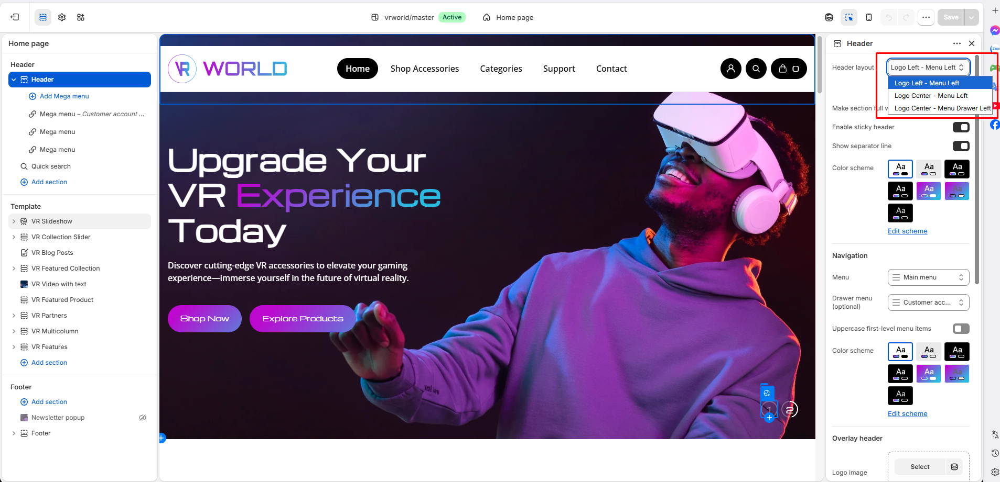

# Header

The Header is one of the most important parts of your store—it’s the first element customers interact with and the central hub for navigation. Positioned at the top of every page, the Header provides quick access to your store logo, main menu, search, shopping cart, and account options, ensuring a smooth and intuitive browsing experience.

**3** **Header layouts:** Logo Left – Menu Left, Logo Center – Menu Left, and Logo Center – Menu Drawer Left

**Enable sticky header**: Select/deselect to show/hide the sticky header. This sticky header appears when users scroll the page from bottom to top.

<figure><figcaption></figcaption></figure>

### Navigation

**Menu:** The main menu of your shop.

**Drawer menu:** you can override the **Menu** as the menu that users will see for mobile or the header layout that has Menu Drawer Left.

Active **Uppercase first-level menu items** to capitalize the main menu

<figure><figcaption></figcaption></figure>

### Overlay header

The Overlay Header is a stylish, modern header layout designed to sit transparently over your store’s main banner or hero image, creating a smooth effect with the background image behind

**Logo image:** Upload the image file of your logo in this area to set it globally on the header.

**Logo mobile image:** Optionally, you can override the **Logo image** that mobile users will see.

The overlay header can be enabled on the **Homepage**, **Blog post** page, and a **Custom page**

With the Custom page option, you need to create a menu, then pick a menu containing items linked to the pages you want to apply the transparent header.

<figure><figcaption></figcaption></figure>

### Language and currency

<figure><figcaption></figcaption></figure>

**Enable language/currency selector**: Option to enable/disable the Language and currency form in the header section.
